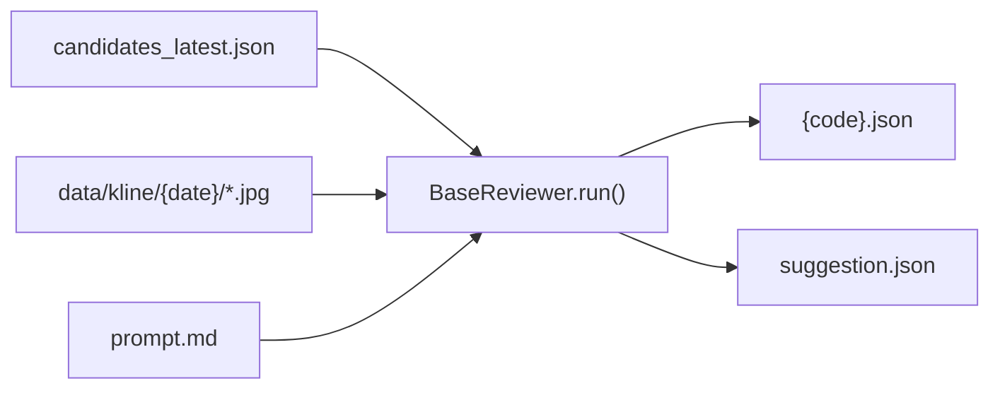

# 量化 K 线图视觉复评 — 多模型扩展指南

> **受众**：下次 agent coding 会话快速上手。
> **目标**：在 `BaseReviewer` 下接入 OpenAI GPT-4o、Claude、通义千问-VL、豆包等视觉模型，或切换 provider，而不改初选/出图/飞书下游契约。

---

## 1. 当前状态（2026-06）

| 组件 | 路径 | 说明 |
|------|------|------|
| 编排入口 | `stock_trade_z/quant_pipeline.py` | 初选 → 出图 → **复评** → 飞书 |
| 复评基类 | `stock_trade_z/quant/review/base_reviewer.py` | 读候选、找图、循环打分、写 `suggestion.json` |
| 唯一实现 | `stock_trade_z/quant/review/gemini_review.py` | `GeminiReviewer`，环境变量 `GEMINI_API_KEY` |
| 评分 rubric | `stock_trade_z/quant/review/prompt.md` | 系统提示词，**provider 无关**，各模型共用 |
| 配置 | `config/gemini_review.yaml` | 路径、模型名、延迟、分数门槛 |
| K 线图输入 | `data/kline/{pick_date}/{code}_day.jpg` | 由 `export_kline_charts.py` 生成 |
| 单股输出 | `data/review/{pick_date}/{code}.json` | 含 `total_score`、`verdict` 等 |
| 汇总输出 | `data/review/{pick_date}/suggestion.json` | 下游契约，`quant_pipeline` / 飞书报告只读此文件 |

**CI 现状**：`.github/workflows/daily-stock-trade.yml` 中 quant 步骤已注释；Gemini 复评默认不跑。本地可：

```bash
uv run stock-quant-pipeline --data-dir ./data --skip-review   # 仅初选+出图
uv run stock-quant-pipeline --data-dir ./data                # 含 Gemini（需 GEMINI_API_KEY）
```

---

## 2. 数据流（复评段）



`BaseReviewer.run()` 已封装：

1. 读 `candidates` → 得到 `pick_date` + 代码列表
2. 对每只股票：`find_chart_images()` → `review_stock()` → 写 `{code}.json`
3. `generate_suggestion()` → 写 `suggestion.json`
4. 支持 `skip_existing`、`request_delay`（防限流）

**子类只需实现** `review_stock(code, day_chart, prompt) -> dict`。

---

## 3. 输出 JSON 契约（不可破坏）

`prompt.md` 要求模型返回如下结构（`BaseReviewer.extract_json()` 解析）：

```json
{
  "trend_reasoning": "string",
  "position_reasoning": "string",
  "volume_reasoning": "string",
  "abnormal_move_reasoning": "string",
  "signal_reasoning": "string",
  "scores": {
    "trend_structure": 1,
    "price_position": 1,
    "volume_behavior": 1,
    "previous_abnormal_move": 1
  },
  "total_score": 4.2,
  "signal_type": "trend_start",
  "verdict": "PASS",
  "comment": "一句中文交易员点评"
}
```

子类在 `review_stock()` 末尾应设置 `result["code"] = code`（与 `GeminiReviewer` 一致）。

`generate_suggestion()` 依赖字段：

- `total_score`（排序 + 门槛过滤，`suggest_min_score` 默认 4.0）
- `verdict`、`signal_type`、`comment`（写入推荐表）
- `code`（排除列表）

**不要改** `suggestion.json` 的顶层 schema，否则 `quant_pipeline._print_recommendations()` 和 `quant/report.py` 需同步改。

---

## 4. 推荐目标架构（待实现）

当前 `gemini_review.py` 同时承担 **配置加载 + Gemini 实现 + `run_review()` 入口**。扩展多 provider 时建议拆成：

```
stock_trade_z/quant/review/
├── base_reviewer.py          # 不变
├── prompt.md                 # 不变（或按 provider 分叉 prompt_*.md）
├── factory.py                # 新增：按 config.provider 实例化 Reviewer
├── config.py                 # 新增：统一 load_config()，合并 DEFAULT_CONFIG
├── gemini_reviewer.py        # 从 gemini_review.py 拆出类
├── openai_reviewer.py        # 新增
├── claude_reviewer.py        # 新增
├── qwen_reviewer.py          # 新增
├── doubao_reviewer.py        # 新增
└── run_review.py             # 统一入口：run_review(config_path) -> dict | None
```

### 4.1 配置演进

将 `config/gemini_review.yaml` **重命名或并列**为 `config/vision_review.yaml`：

```yaml
# vision_review.yaml
provider: gemini          # gemini | openai | claude | qwen | doubao
candidates: data/candidates/candidates_latest.json
kline_dir: data/kline
output_dir: data/review
prompt_path: stock_trade_z/quant/review/prompt.md
model: gemini-2.0-flash   # provider 内模型 ID
request_delay: 5
skip_existing: false
suggest_min_score: 4.0

# provider 专属（可选）
openai:
  base_url: https://api.openai.com/v1
claude:
  api_version: "2023-06-01"
qwen:
  base_url: https://dashscope.aliyuncs.com/compatible-mode/v1
doubao:
  base_url: https://ark.cn-beijing.volces.com/api/v3
```

环境变量约定：

| provider | 环境变量 | 备注 |
|----------|----------|------|
| `gemini` | `GEMINI_API_KEY` | 已实现 |
| `openai` | `OPENAI_API_KEY` | 项目已有 `openai` 依赖 |
| `claude` | `ANTHROPIC_API_KEY` | 需加 `anthropic` 包 |
| `qwen` | `DASHSCOPE_API_KEY` | 通义，OpenAI-compatible 或官方 SDK |
| `doubao` | `ARK_API_KEY` 或 `DOUBAO_API_KEY` | 火山方舟，OpenAI-compatible 常见 |

### 4.2 Factory 伪代码

```python
# stock_trade_z/quant/review/factory.py
from stock_trade_z.quant.review.gemini_reviewer import GeminiReviewer
# from .openai_reviewer import OpenAIReviewer
# ...

_REGISTRY = {
    "gemini": GeminiReviewer,
    # "openai": OpenAIReviewer,
}

def create_reviewer(config: dict[str, Any]) -> BaseReviewer:
    provider = config.get("provider", "gemini")
    cls = _REGISTRY.get(provider)
    if cls is None:
        raise ValueError(f"未知 vision provider: {provider}")
    return cls(config)
```

`quant_pipeline.py` 应改为：

```python
from stock_trade_z.quant.review.run_review import run_review, load_config
```

而不是硬编码 `gemini_review`。

---

## 5. 新 Provider 实现清单

每个 Reviewer 一个文件，继承 `BaseReviewer`，**只实现 `review_stock()`**（及 `__init__` 里初始化 client）。

### 5.1 通用模式

```python
def review_stock(self, code: str, day_chart: Path, prompt: str) -> dict:
    # 1. 读图 bytes + mime（复用 Gemini 的 mime_map 可抽到 review/utils.py）
    # 2. 构造 multimodal 请求：
    #    - system / instructions = prompt（整份 prompt.md）
    #    - user = 简短说明 + 图片
    # 3. temperature ≈ 0.2（与 Gemini 对齐）
    # 4. response_text = ...
    # 5. result = self.extract_json(response_text)
    # 6. result["code"] = code
    # 7. return result
```

用户侧文案建议与 Gemini 保持一致：

```text
股票代码：{code}

以下是该股票的 **日线图**，请按照系统提示中的框架进行分析，并严格按照要求输出 JSON。
```

### 5.2 OpenAI GPT-4o（优先推荐）

- **依赖**：已有 `openai>=2.41`
- **模型**：`gpt-4o`、`gpt-4o-mini`
- **API 形态**：Chat Completions，`messages` 含 `image_url`（base64 data URL）

```python
import base64
from openai import OpenAI

def _b64_data_url(path: Path) -> str:
    mime = "image/jpeg" if path.suffix.lower() in {".jpg", ".jpeg"} else "image/png"
    b64 = base64.standard_b64encode(path.read_bytes()).decode()
    return f"data:{mime};base64,{b64}"

response = client.chat.completions.create(
    model=self.config["model"],
    temperature=0.2,
    messages=[
        {"role": "system", "content": prompt},
        {
            "role": "user",
            "content": [
                {"type": "text", "text": user_text},
                {"type": "image_url", "image_url": {"url": _b64_data_url(day_chart)}},
            ],
        },
    ],
)
text = response.choices[0].message.content
```

### 5.3 Claude（Anthropic）

- **依赖**：`anthropic`
- **模型**：`claude-sonnet-4-20250514`、`claude-3-5-sonnet-latest` 等支持 vision 的型号
- **要点**：`system` 传 prompt；`messages[].content` 为 `[{"type":"image",...}, {"type":"text",...}]`

```python
message = client.messages.create(
    model=self.config["model"],
    max_tokens=4096,
    system=prompt,
    messages=[{
        "role": "user",
        "content": [
            {"type": "image", "source": {"type": "base64", "media_type": mime, "data": b64}},
            {"type": "text", "text": user_text},
        ],
    }],
)
text = message.content[0].text
```

### 5.4 通义千问-VL（DashScope）

- **方式 A**：OpenAI-compatible endpoint + `qwen-vl-max` / `qwen2.5-vl-72b-instruct`
- **方式 B**：官方 `dashscope` SDK 多模态接口
- **环境变量**：`DASHSCOPE_API_KEY`
- 图片多为 base64 或 URL；参考当前 DashScope 文档选用与 OpenAI 最接近的 compatible 路径，减少自定义代码。

### 5.5 豆包 / 火山方舟

- 通常 **OpenAI-compatible**：`base_url` + `ARK_API_KEY`
- 模型填 endpoint ID（如 `doubao-vision-pro-32k` 或控制台里的 ep-xxx）
- 请求体与 OpenAI GPT-4o 类似，注意个别字段名差异（实现时以官方文档为准）。

---

## 6. 与 DeepSeek 的关系（非视觉）

| 能力 | 模块 | 输入 | 能否替代视觉复评 |
|------|------|------|------------------|
| Z 战法文本复盘 | `lib/llm_analyze.py` | 结构化 K 线摘要 JSON | 否（不看图） |
| 视觉复评 | `quant/review/*` | JPG 日线图 | 是（本指南范围） |

DeepSeek 官方 API（`deepseek-v4-flash`）**不支持图片**。若要用 DeepSeek 做 quant 复评，需另开 `DeepSeekTextReviewer`：不传图，改传 `summarize_kline()` 等结构化字段，并**单独写 prompt**——那是文本复评，不是本指南的 vision 扩展。

---

## 7. 实现任务分解（给 agent 的检查列表）

### Phase 1 — 解耦（小 diff，先做）

- [ ] 新增 `review/config.py`：统一 `DEFAULT_CONFIG`、`load_config()`、`get_config_path("vision_review.yaml")`
- [ ] 新增 `review/factory.py` + `review/run_review.py`
- [ ] `GeminiReviewer` 移到 `gemini_reviewer.py`，`gemini_review.py` 保留薄 CLI 或废弃
- [ ] `quant_pipeline.py` 改为 `from ...run_review import run_review, load_config`
- [ ] `config/vision_review.yaml` 增加 `provider: gemini`，旧 `gemini_review.yaml` 可 redirect 或删除

### Phase 2 — 加 OpenAI（验证架构）

- [ ] `openai_reviewer.py` + `OPENAI_API_KEY` in `.env.example` / `setup.py` / `check_setup.py`
- [ ] factory 注册 `"openai"`
- [ ] 单股手工测试：一张 `_day.jpg` → 合法 JSON

### Phase 3 — 其他 provider

- [ ] `claude_reviewer.py`、`qwen_reviewer.py`、`doubao_reviewer.py` 按需添加
- [ ] `pyproject.toml` optional extras：`[project.optional-dependencies] vision-claude = ["anthropic"]`

### Phase 4 — 运维

- [ ] 取消注释 CI quant 步骤时，用 `provider` 配置而非写死 Gemini
- [ ] `quant/report.py` 文案从「Gemini 推荐」改为「视觉复评推荐」（provider 中立）
- [ ] `BaseReviewer` 模块 docstring 去掉「Gemini」字样

---

## 8. 测试与验收

```bash
# 1. 有候选 + 有图（先跑初选，或复用已有 candidates_latest.json）
uv run stock-quant-pipeline --data-dir ./data --skip-review

# 2. 仅复评（实现 run_review 后）
uv run python -c "
from stock_trade_z.quant.review.run_review import run_review
print(run_review())
"

# 3. 检查产物
ls data/review/$(jq -r .pick_date data/candidates/candidates_latest.json)/
cat data/review/.../suggestion.json | jq '.recommendations[:3]'
```

**单测建议**（无需真 API）：

- `extract_json()`：带 markdown code fence 的样例字符串
- `generate_suggestion()`：mock `all_results` 列表
- `find_chart_images()`：临时目录放 `{code}_day.jpg`

**真 API 冒烟**：1 只股票、1 张图、`request_delay=0`，对比 `total_score` 是否在 1–5 合理区间。

---

## 9. 代码规范（stock_trade_old）

- `from __future__ import annotations`
- 日志：`get_logger("quant")`（已在 `logger.py` Literal 中注册）
- 路径：`get_project_root()` / `get_config_path()`，禁止 `Path(__file__).parent.parent` 当项目根
- 提交前：`uv run ruff check --fix . && uv run ruff format .`
- 迁移来的数值代码若含 `E701/E702`，在 `pyproject.toml` 的 `per-file-ignores` 中按文件豁免，不要大范围改算法格式

---

## 10. 关键文件速查

| 要改什么 | 文件 |
|----------|------|
| 加新模型类 | `stock_trade_z/quant/review/{provider}_reviewer.py` |
| 注册 provider | `stock_trade_z/quant/review/factory.py` |
| 改配置项 | `config/vision_review.yaml` |
| 改评分标准 | `stock_trade_z/quant/review/prompt.md` |
| 改流水线调用 | `stock_trade_z/quant_pipeline.py` |
| 改飞书报告文案 | `stock_trade_z/quant/report.py`、`lib/lark_report.py` |
| 改依赖 | `pyproject.toml` |
| 改密钥向导 | `setup.py`、`check_setup.py`、`.env.example` |

---

## 11. 参考实现

当前唯一视觉实现：

```73:101:stock_trade_z/quant/review/gemini_review.py
    def review_stock(self, code: str, day_chart: Path, prompt: str) -> dict:
        user_text = (
            f"股票代码：{code}\n\n"
            "以下是该股票的 **日线图**，请按照系统提示中的框架进行分析，"
            "并严格按照要求输出 JSON。"
        )
        # ... multimodal API call ...
        result = self.extract_json(response_text)
        result["code"] = code
        return result
```

循环与落盘逻辑无需复制，已在 `BaseReviewer.run()`：

```82:158:stock_trade_z/quant/review/base_reviewer.py
    def run(self) -> dict | None:
        # load candidates → per-stock review_stock → suggestion.json
```

---

**下次 agent 开场白建议**：「阅读 `docs/quant-vision-review.md`，按 Phase 1–2 实现 `vision_review.yaml` + OpenAI reviewer，保持 `suggestion.json` 契约不变。」
